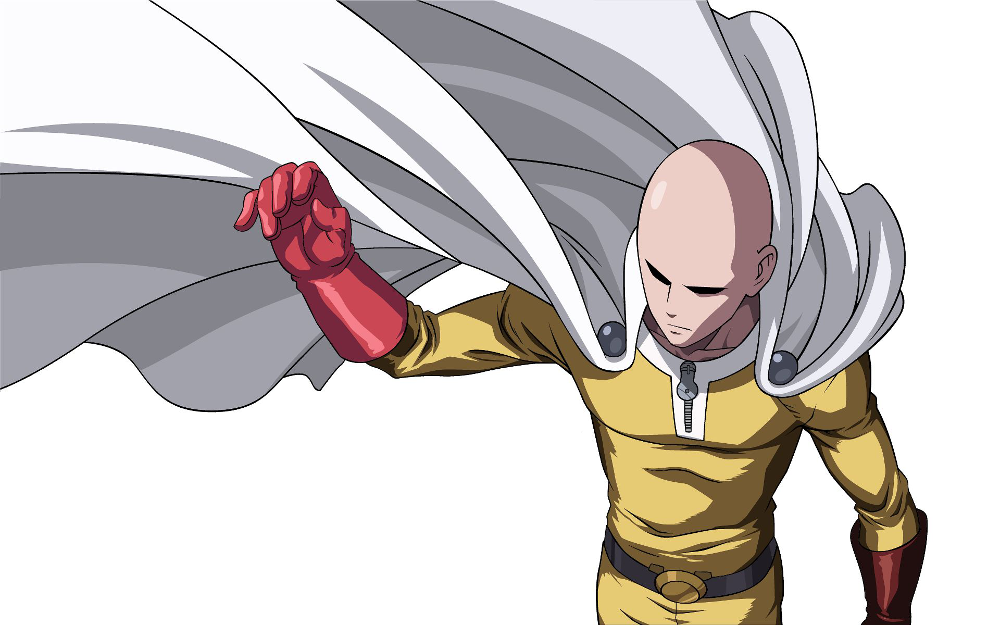

# Hi! I'm Juan :wave:

I am graduated in cyber defense with focus on espionage, I work in the front line defense of a multinational company. 

I have a more offensive profile but throughout my career I have conducted awareness training and architected defense strategies for several organizations.

:blue_book: Blue Team :large_blue_circle:  
I work with several defense fronts from policy development to awareness, trainings, audits and configurations/adjustments in defense tools.  

:closed_book: Red Team :red_circle:  
I conduct red team exercises, apply pentests and generate intelligence to tune the rules of the current environment.

I have knowledge in several air gap attacks. 

I am currently studying hacking of mainframes.

~With great power great responsibilities.  

:frog:   
